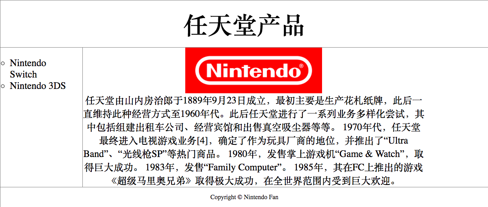
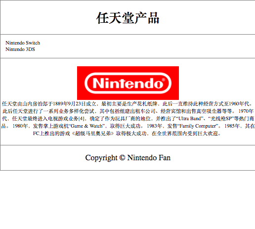

# HTML Homework 5
## Motivation
+ Use what we learn about `HTML head`, `HTML Layout`, `Responsive HTML` and **MAYBE** some CSS framework like `Bootstrap` to implement a web page(*~~or two~~*)

***

## Goal
### Basic
1. Implement the `main.html`
### Extra
1. Dig into the code in `main.html`
1. Dig into the code in `mystyle.css`
1. __EXTRA POINTS__: implement `extra.html`
___
## Due Time
+ By Jan. 10th 11:00a
---
## Reference
- Main Part
    * General view:
        + 
    * Small screen view:
        + 
- Extra Part
    * ![Broken extra html view][extra image]

[extra image]: screenshots/extra.png "Extra Part"